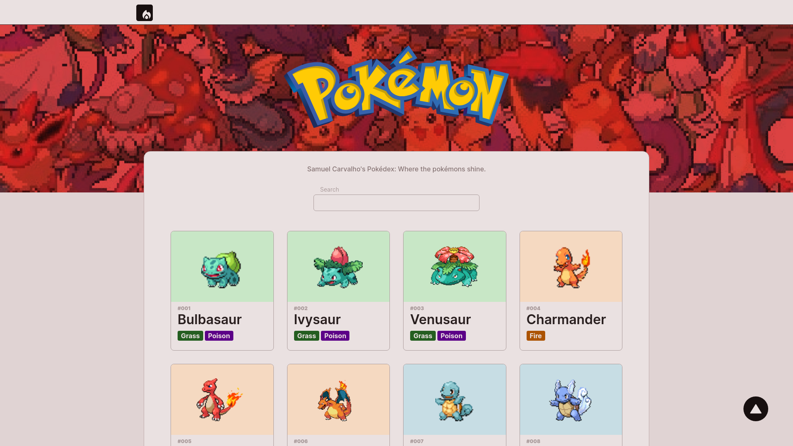

<h1 align="center">
Pokemon Pokedex With React Js Next Js(13) Typescript Axios Jest React Testing Library SWR Eslint
</h1>

 

<h2 align="center"><a href="https://samuelcarvalho.vercel.app/projects/pokemon" align="center"> 🖥️  CHECK OUT: ONLINE SITE! -></a></h2>

 

  <a href="#description">Description</a> &nbsp;&nbsp;&nbsp;|&nbsp;&nbsp;&nbsp <a href="#install">Install</a> &nbsp;&nbsp;&nbsp;|&nbsp;&nbsp;&nbsp <a href="#technologies">Technologies</a> &nbsp;&nbsp;&nbsp;|&nbsp;&nbsp;&nbsp <a href="#related">Related</a> &nbsp;&nbsp;&nbsp;|&nbsp;&nbsp;&nbsp <a href="#references">References</a> &nbsp;&nbsp;&nbsp;|&nbsp;&nbsp;&nbsp <a href="#contact">Contact</a>

 
 

<h3 id="description">✍️ Description:</h3>

This project was made with the latest technologies using Next Js 13: SSR(Server Side Rendering), Axios, SWR, React Paginate, CSS Modules And TDD with Jest Js (Using React Testing Library). Have Fun!

 

<h3 id="install">🔍  Install:</h3>

To create this project I have used Next, but as long as I stated with npm, I think you are going to have problems to use with yarn.The best tip gave to you as a beginner is use npm or migrate to yarn, if all you want is just try - use npm:

**To install the package:**

`npm install`

**To Start Development Script:**

`npm run dev`

**If you want to create production build:**

`npm run build`

**To Run The Tests:**

`npm run test`

 

<h3 id="technologies">🚀  Technologies:</h3>

To build this project is used:

- React Js
- Next Js
- Typescript
- Npm
- Node
- Axios
- React Paginate
- Eslint
- Prettier
- EditorConfig
- SWR
- Jest Js
- React Testing Library

 

<h3 id="related">♟️  Related:</h3>

See more:

<ul>
  <li><a href="https://github.com/samuelcarvalhodeveloper/Google-Clone-w-React-Js-Typescript-Styled-Components-Prettier-Eslint-EditorConfig">Google Clone</a></li>
  <li><a href="https://github.com/samuelcarvalhodeveloper/Pinterest-Clone-w-React-Js-Typescript-Styled-Components-Prettier-Eslint-EditorConfig">Pinterest Clone</a></li>
  <li><a href="https://github.com/samuelcarvalhodeveloper/Starbucks-Clone-w-React-Js-Typescript-Context-Api-Styled-Components-Prettier-Eslint-EditorConfig">Starbucks Clone</a></li>
  <li><a href="https://github.com/samuelcarvalhodeveloper/Facebook-Clone-w-React-Js-Typescript-Styled-Components-Prettier-Eslint-EditorConfig">Facebook Clone</a></li>
  <li><a href="https://github.com/samuelcarvalhodeveloper/Calculator-w-React-Js-Redux-ToolKit-Typescript-Styled-Components-Prettier-Eslint-EditorConfig">Calculator w/ Redux</a></li>
</ul>

 

<h3 id="references">📖  References:</h3>

**Next Js BoilerPlate:**

[https://github.com/samuelcarvalhodeveloper/NextJs-Typescript-Boilerplate-w-SSR-Eslint-Prettier-EditorConfig-Configured-Testing-Library](https://github.com/samuelcarvalhodeveloper/NextJs-Typescript-Boilerplate-w-SSR-Eslint-Prettier-EditorConfig-Configured-Testing-Library)

 

<h3 id="contact">✉️  Contact:</h3>

**Email:**
<a href="mailto:personal.samuelcarvalho@gmail.com">personal.samuelcarvalho@gmail.com</a>

 
 

<strong>Repository Link:</strong>

[https://github.com/samuelcarvalhodeveloper/Pokemon-Pokedex-w-React-Js-Next-Js-13-Typescript-Axios-Jest-React-Testing-Library-SWR-Eslint](https://github.com/samuelcarvalhodeveloper/Pokemon-Pokedex-w-React-Js-Next-Js-13-Typescript-Axios-Jest-React-Testing-Library-SWR-Eslint)
